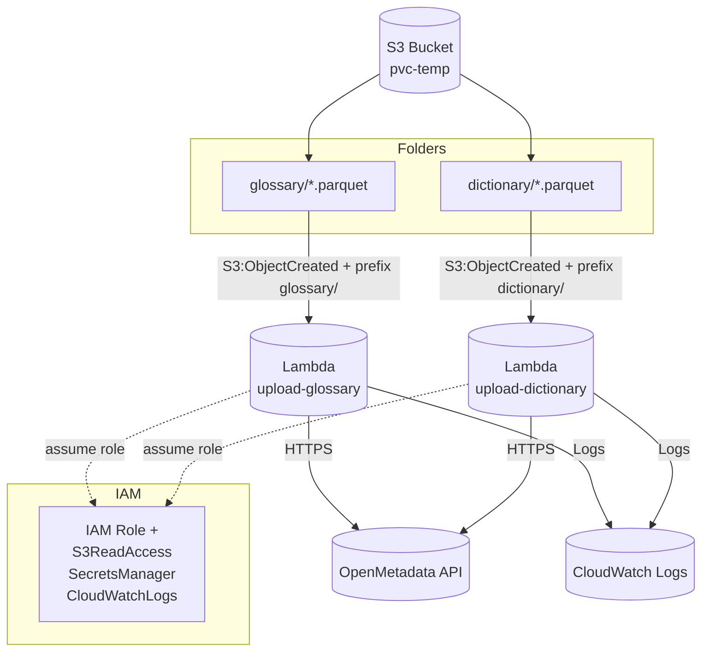

# Batch Upload (Glossary & Dictionary)

## 🎯 Mục đích
Hai Lambda `batch-upload-glossary` và `batch-upload-dictionary` tự động đọc file `.parquet` từ S3 và đẩy dữ liệu vào OpenMetadata qua REST API. Mỗi service dùng S3 Event (ObjectCreated) làm trigger, tách biệt theo `prefix` để tránh gọi nhầm nhau.

## 🏗 Kiến trúc tổng quan


## Cấu trúc thư mục chính
- `modules/layer/batch-upload/` — Module Terraform tạo Lambda, IAM, S3 notification.
- `modules/aws-resources/lambda/` — Module con provisioning Lambda (log group, role wiring,...).
- `services/batch-upload-glossary/` — Service Glossary: tfvars, main.tf gọi module chung.
- `services/batch-upload-dictionary/` — Service Dictionary: tfvars, main.tf gọi module chung.
- `services/*/lambda/` — Source code Python + gói zip deploy.
- `docs/batch-upload/readme.md` — Tài liệu này.

## Resource chính (Terraform)
**Trong `modules/layer/batch-upload/main.tf`:**
- `module "lambda_functions"` — tạo Lambda theo map `lambda_functions`.
- `aws_lambda_permission.allow_s3_invoke` — cho phép S3 invoke Lambda.
- `aws_s3_bucket_notification.lambda_triggers` — cấu hình event S3 `ObjectCreated` với filter prefix/suffix.
- IAM role: S3 read, Secrets Manager read, CloudWatch logs, VPC access.

**Biến cấu hình quan trọng (module):**
- `s3_bucket_arns` — danh sách ARN bucket cần quyền đọc.
- `s3_event_triggers` — danh sách trigger S3:
  - `bucket_name`, `lambda_key`
  - `events` (mặc định `"s3:ObjectCreated:*"`)
  - `filter_prefix`, `filter_suffix`
- `lambda_functions` — map cấu hình Lambda (name, handler, runtime, timeout, memory, layers, env, vpc...).

## ⚙️ Cấu hình mẫu (tfvars)
### Glossary (`services/batch-upload-glossary/terraform.tfvars`)
```hcl
s3_event_triggers = [
  {
    bucket_name   = "pvc-temp"
    lambda_key    = "upload-glossary"
    events        = ["s3:ObjectCreated:*"]
    filter_prefix = "glossary/"
    filter_suffix = ".parquet"
  }
]

lambda_functions = {
  "upload-glossary" = {
    function_name = "upload-glossary"
    handler       = "index.lambda_handler"
    runtime       = "python3.11"
    timeout       = 900
    memory_size   = 1024
    filename      = "lambda/upload-glossary.zip"
    layers = [
      "arn:aws:lambda:ap-southeast-1:336392948345:layer:AWSSDKPandas-Python311:26"
    ]
    environment = {
      variables = {
        MAIN_URL        = "https://om.apps.dap.dev.pvcombank.io/api"
        OM_TOKEN_SECRET = "dev/om/access-token"
      }
    }
  }
}
```

### Dictionary (`services/batch-upload-dictionary/terraform.tfvars`)
```hcl
s3_event_triggers = [
  {
    bucket_name   = "pvc-temp"
    lambda_key    = "upload-dictionary"
    events        = ["s3:ObjectCreated:*"]
    filter_prefix = "dictionary/"
    filter_suffix = ".parquet"
  }
]

lambda_functions = {
  "upload-dictionary" = {
    function_name = "upload-dictionary"
    handler       = "index.lambda_handler"
    runtime       = "python3.11"
    timeout       = 900
    memory_size   = 1024
    filename      = "lambda/upload-dictionary.zip"
    layers = [
      "arn:aws:lambda:ap-southeast-1:336392948345:layer:AWSSDKPandas-Python311:26"
    ]
    environment = {
      variables = {
        MAIN_URL        = "https://om.apps.dap.dev.pvcombank.io/api"
        OM_TOKEN_SECRET = "dev/om/access-token"
      }
    }
  }
}
```

##  Logic code (Python Lambda)
1) **Nhận event S3**: `lambda_handler(event, context)` duyệt `event["Records"]`, lấy `bucket` & `key`.
2) **Đọc Parquet**: `boto3` tải object, `pandas.read_parquet(BytesIO(...))` -> DataFrame.
3) **Lấy token**: đọc secret name từ env `OM_TOKEN_SECRET`, gọi Secrets Manager -> JWT.
4) **Gửi lên OpenMetadata**: duyệt từng row, map field -> payload, gọi REST (using `requests`).
5) **Log & lỗi**: ghi CloudWatch; nếu lỗi per-row vẫn tiếp tục các row khác, báo cáo cuối hàm.

## Triển khai
1. Đóng gói Lambda (nếu dùng script):
   ```bash
   bash services/batch-upload-glossary/build_lambda.sh --docker
   bash services/batch-upload-dictionary/build_lambda.sh --docker
   ```
2. Terraform init & apply từng service:
   ```bash
   cd services/batch-upload-glossary
   terraform init
   terraform apply -auto-approve

   cd ../batch-upload-dictionary
   terraform init
   terraform apply -auto-approve
   ```
3. Kiểm thử: upload file thử
   ```bash
   aws s3 cp sample.parquet s3://pvc-temp/glossary/sample.parquet
   aws s3 cp sample.parquet s3://pvc-temp/dictionary/sample.parquet
   ```
   Kiểm tra log tại CloudWatch: `/aws/lambda/<env>-<acct>-upload-glossary` hoặc `upload-dictionary`.

##  Troubleshooting nhanh
- **Không thấy trigger**: kiểm tra đúng prefix/suffix, bucket `pvc-temp`, và S3 bucket phải bật notification duy nhất (S3 chỉ cho 1 cấu hình notification; nếu có tool khác đã chiếm, cần hợp nhất cấu hình).
- **Không đọc được file**: chắc chắn file `.parquet` và prefix khớp `glossary/` hoặc `dictionary/`.
- **403 khi gọi OpenMetadata**: kiểm tra secret `OM_TOKEN_SECRET` và VPC outbound/network tới endpoint `MAIN_URL`.
- **Timeout**: tăng `memory_size` hoặc tối ưu payload batch; mặc định timeout 900s.

## Checklist cấu hình tối thiểu
- Bucket S3: `pvc-temp` tồn tại.
- Prefix: `glossary/` cho Glossary, `dictionary/` cho Dictionary.
- Suffix: `.parquet`.
- Secrets Manager: có secret `dev/om/access-token` (JWT hợp lệ).
- Lambda layer `AWSSDKPandas-Python311` đã tham chiếu đúng ARN vùng `ap-southeast-1`.

---
Tài liệu này nằm tại `docs/batch-upload/readme.md` và bao quát cả hai service Glossary & Dictionary.
