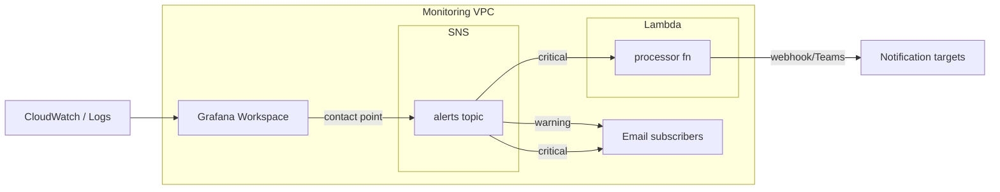

# Monitoring Service module

Tài liệu này mô tả kiến trúc, tham số cấu hình và cơ chế alert của module `services/monitoring-service`, triển khai hạ tầng giám sát với IAM role dùng chung, Amazon Managed Grafana, SNS topics và các Lambda xử lý thông báo.

## Kiến trúc (logic)
- **IAM Role chung** (`monitoring-service`): cho phép Grafana + Lambda đọc CloudWatch/Logs/SNS/Lambda/EC2; có thể gắn thêm managed policy tùy nhu cầu.
- **Amazon Managed Grafana** (tùy chọn bật qua `create_grafana`): workspace gắn data sources (CloudWatch/Prometheus/X-Ray), hỗ trợ unified alerting (qua `grafana_configuration`). Có thể đặt trong VPC riêng bằng SG/Subnet.
- **SNS Topics**: khai báo động qua map `sns_topics`; hỗ trợ DLQ, encryption, subscriber list và allow list publish. Đây là **contact point** để Grafana gửi alert notification (và cho các producer khác). Có cơ chế auto thêm email subscriber cho topic cảnh báo (`enable_alert_email_subscribers`, `alert_emails`) và có thể định tuyến theo label (vd warning/critical) trong contact point của Grafana.
- **Lambda Functions**: triển khai từ zip/S3; dùng IAM role chung; có thể đặt VPC, DLQ, X-Ray, layers. 
- **SNS → Lambda triggers**: mapping `lambda_sns_triggers` tạo permission + subscription tự động. Flow alert: Grafana (contact point) hoặc producer khác publish SNS `alerts` → Lambda `processor` (nếu cấu hình) → webhook/Teams/Slack tùy logic code.

### Sơ đồ mermaid

## Tham số cấu hình chính
Tham khảo `variables.tf`; ví dụ giá trị trong `envs/dev/terraform.tfvars` đã được comment sẵn.

### Chung
- `region`, `namespace`, `stage`, `delimiter`, `attributes`, `tags`
- `assume_role`: ARN role để provider assume (nếu cross-account)

### IAM
- `iam_role_name`, `trusted_role_services` (mặc định Lambda + Grafana), `role_policy_arns` (managed policies bổ sung), `custom_iam_policy` (truyền từ `local.monitoring_iam_policy`)

### Grafana
- Bật/tắt: `create_grafana`, `create_grafana_workspace`
- Đặt tên/mô tả: `grafana_name`, `grafana_description`
- Quyền/SSO: `grafana_account_access_type`, `grafana_authentication_providers` (AWS_SSO/SAML), `grafana_permission_type`
- Data sources: `grafana_data_sources` (vd CLOUDWATCH, PROMETHEUS, XRAY)
- Phiên bản & license: `grafana_version`, `grafana_associate_license` (false = Essentials)
- Cấu hình JSON: `grafana_configuration` (ví dụ bật unifiedAlerting)
- VPC: `grafana_vpc_configuration` (security_group_ids, subnet_ids), `grafana_create_security_group`, `grafana_security_group_name/rules`

### SNS
- `sns_topics`: map cấu hình topic (fifo, encryption, kms_master_key_id, subscribers, dlq, allowed_aws_services, allowed_iam_arns)
- `enable_alert_email_subscribers`: bật auto-subscribe email
- `alert_emails`: danh sách email

### Lambda
- `lambda_functions`: map function với `function_name`, `handler`, `runtime`, `timeout`, `memory_size`, code source (`filename` hoặc `s3_bucket`+`s3_key`), `environment.variables`, `vpc_config`, `logs_retention_days`, `tracing_mode`, `dead_letter_config_target_arn`, `layers`
- `lambda_sns_triggers`: map `{ key = { lambda_key, sns_key } }` tạo permission + subscription

## Cách alert hoạt động
- **Định tuyến theo mức độ (label)**: cấu hình contact point/route trong Grafana để gửi vào SNS `alerts`. Ví dụ: `warning` → chỉ email subscribers; `critical` → email subscribers **và** Lambda `processor` để fan-out thêm webhook/Teams/Slack.
- **Qua SNS → Lambda**: các dịch vụ khác cũng có thể publish vào topic. Lambda được map qua `lambda_sns_triggers` và sẽ fan-out theo logic code (vd `TEAMS_WEBHOOK_URL`).
- **Grafana unified alerting**: tạo alert rule, set contact point là SNS topic này để thừa kế định tuyến trên.
- **Bảo mật & phân quyền**: IAM role giới hạn dịch vụ được assume (`trusted_role_services`). Email subscribers chỉ được gắn khi `enable_alert_email_subscribers=true` để tránh spam.

## Triển khai & vận hành
1) Cập nhật `envs/<env>/terraform.tfvars` với VPC, SG, subnet, danh sách topic, email, Lambda code path, webhook env.
2) (Tùy chọn) Đóng/mở Grafana bằng `create_grafana`. Nếu không tạo mới, có thể để `create_grafana_workspace=false` và chỉ tái dùng IAM.
3) Chạy Terraform tại `services/monitoring-service` với backend/role phù hợp.
4) Sau deploy: 
   - Kiểm tra SNS topic + subscription email (sẽ ở trạng thái PendingConfirm cho đến khi người dùng confirm).
   - Kiểm tra Lambda log group và thử publish test message đến topic để xác nhận pipeline đến webhook/email.
   - Với Grafana: truy cập endpoint output, cấu hình data source/alert channel trong UI nếu cần bổ sung.

## Output tham khảo
- IAM: `iam_role_arn`, `iam_role_name`
- Grafana: `grafana_workspace_id`, `grafana_workspace_arn`, `grafana_workspace_endpoint`, `grafana_workspace_grafana_version`
- SNS: `sns_topic_arns`, `sns_topic_names`, `sns_topic_ids`
- Lambda: `lambda_function_arns`, `lambda_function_names`, `lambda_function_invoke_arns`, `lambda_function_qualified_arns`, `lambda_cloudwatch_log_groups`
